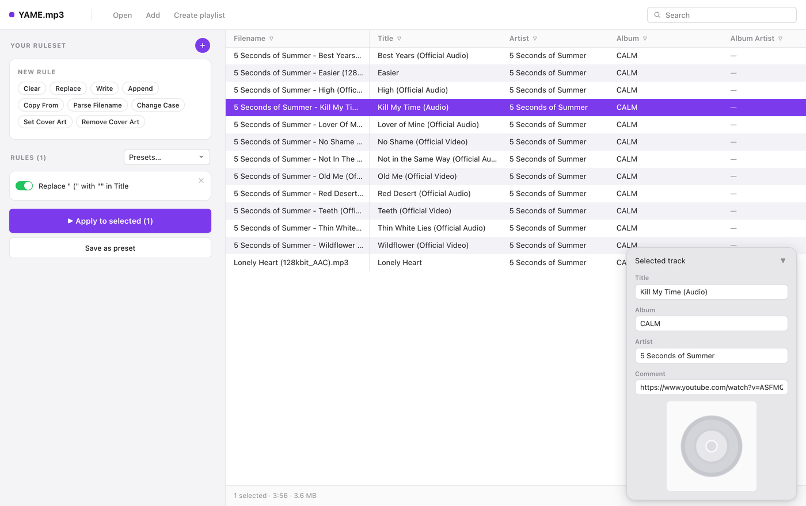
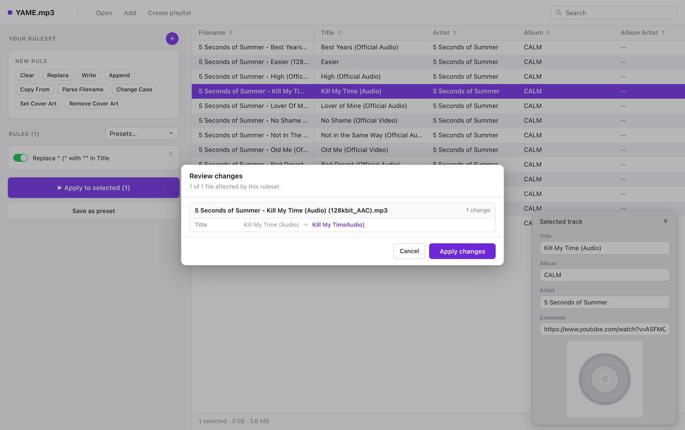
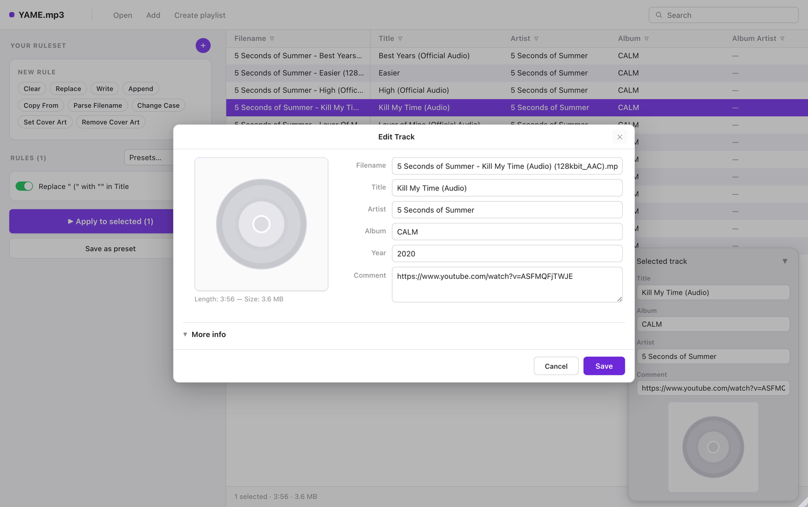

# YAME.mp3

**Y**et **A**nother **M**etadata **E**ditor - a free, open-source, rule-based
batch metadata editor for your local music library.

Point YAME at a folder, describe the clean-up you want as a handful of visible
rules, preview exactly what will change, and apply it to every file at once.
No scripting, no terminal, no subscription.



## Download

Take the latest `.dmg` from the [Releases page](../../releases/latest), open it,
and drag **YAME** into your Applications folder.

- macOS 10.15 or later
- Apple Silicon (M-series)

## Why this exists

If you keep your music as files, you already know the ritual: every new batch
of downloads arrives with the artist buried in the title, a YouTube URL in the
comment field, and inconsistent capitalisation. Fixing that by hand, one file
at a time, is tedious — and the tools that automate it either cost money, hide
the automation behind a scripting language, or make you fight the interface.

YAME takes the opposite approach. The repetitive part of the job is expressed
as **rules you can see and reorder**, the result is shown to you *before*
anything is written, and the ruleset you built last month is one click away
the next time you need it.

## Features

- **Nine rule types**, each a single plain step — see [The rules](#the-rules).
- **Live preview** — the rule builder shows the before/after on a real track
  from your selection as you type, and picks the first track the rule actually
  affects.
- **Dry run by default** — *Apply* always shows every per-file change first.
  Nothing touches your files until you confirm.
- **Presets** — save a ruleset, reload it in one click, export and import
  rulesets to share them.
- **Cover art** — shown in the track panel and editor; set it by clicking,
  dragging an image in, or pasting from the clipboard. Embed the same artwork
  across a whole batch with a rule.
- **Fast, familiar table** — sortable, reorderable, resizable columns; freeze
  and hide columns by right-clicking a header. Your layout is remembered.
- **Feels like a Mac** — a real menu bar, real context menus (including
  **Open With ▸**, populated from Launch Services with each app's own icon),
  and the usual keyboard shortcuts.
- **Local and private** — everything runs on your machine. Nothing is uploaded,
  and YAME never touches the network.

## The rules

Rules run top to bottom, and you can reorder or disable any of them.

| Rule | What it does | Example |
| --- | --- | --- |
| **Clear** | Removes a field's value | Clear Comment |
| **Replace** | Find and replace, with `*` and `?` wildcards | Replace ` - ` with ` – ` in Title |
| **Write** | Overwrites a field with a fixed value | Write J-Pop to Genre |
| **Append** | Adds text to the end of a field | Append ` (Live)` to Title |
| **Copy From** | Copies one field into another | Copy Year → Album |
| **Parse Filename** | Matches the file name and fills fields from the captures | `* - *` → Artist, Title |
| **Change Case** | UPPER, lower, Title or Sentence case | Title → Title Case |
| **Set Cover Art** | Embeds one image in every file | Batch album art |
| **Remove Cover Art** | Strips embedded artwork | Clear all covers |

Wildcards: `*` matches any run of characters, `?` matches exactly one.
Replace inserts its text literally — to move part of a value into a field, use
**Parse Filename**, which assigns each `*` capture to a field you choose.

## How a ruleset works

1. **Build** — pick a rule type and fill in its fields. YAME previews the
   change on a track you have selected before you commit to anything.
2. **Review** — press *Apply* for a dry run: every file that would change, and
   exactly how.

   

3. **Apply** — write the changes, or go back and adjust the rules.
4. **Save** — keep the ruleset as a preset, so the next batch takes one click.

## Supported formats

YAME reads MP3, M4A/AAC/MP4, FLAC, OGG Vorbis, Opus, WAV, AIFF, WMA/ASF,
MusePack, Monkey's Audio, WavPack and TrueAudio. It writes tags on MP3, M4A,
FLAC, OGG/Opus, WAV and AIFF, plus the APEv2 family. WMA/ASF is read-only (a
limitation of the underlying tag library), and YAME says so rather than
pretending it saved.

One field catalogue maps every concept onto each format's own tag names, so a
ruleset written against an MP3 applies unchanged to a FLAC or an M4A.

## Keyboard shortcuts

| Shortcut | Action |
| --- | --- |
| `⌘O` | Open files (replaces the list) |
| `⇧⌘O` | Add files to the list |
| `⌘F` | Focus search |
| `⌘A` | Select every track |
| `⌘C` / `⌘V` | Copy tracks / paste files from the Finder |
| `↑` `↓` | Move the selection through the list |
| `⌘`-click | Add or remove a track from the selection |
| `⇧`-click | Select a range |
| Double-click | Open the full editor |

Editing the file name is also how you rename a file on disk. YAME keeps the
original extension, because renaming does not convert between formats — and it
will never let a rule leave a file nameless.



## Where your data lives

| What | Where |
| --- | --- |
| Presets | `~/.config/yame/presets.json` |
| Table layout | Local app storage |

Presets are plain JSON — easy to read, easy to back up, easy to share. Set
`YAME_CONFIG_DIR` to keep them somewhere else.

## Building from source

You will need Node 20+, [pnpm](https://pnpm.io), Python 3.13 with
[uv](https://docs.astral.sh/uv/), and Rust 1.77+.

```bash
git clone https://github.com/ZhifangL/mp3MetadataEditor.git
cd mp3MetadataEditor
```

**Run it in development** (two terminals):

```bash
# 1. the engine — picks a free port and publishes it
cd mp3-metadata-api
uv sync
.venv/bin/python main.py

# 2. the interface
cd mp3-desktop-frontend
pnpm install
pnpm run dev            # http://localhost:5173
```

The Vite dev server reads the port the engine published, so the two find each
other without any configuration. Add `?folder=/path/to/music` to the URL to
load a folder on startup.

**Build the app:**

```bash
cd mp3-desktop-frontend
pnpm run package        # -> src-tauri/target/release/bundle/
```

That freezes the engine with PyInstaller, builds the interface, compiles the
Rust shell, and writes `YAME.app` and a `.dmg`. A full macOS bundle is about
20 MB.

Other useful scripts:

| Command | What it does |
| --- | --- |
| `pnpm run desktop:dev` | Tauri window against the running dev server |
| `pnpm run sidecar` | Rebuild just the bundled engine |
| `pnpm run icon` | Regenerate the app icon from `public/favicon.svg` |

**Tests:**

```bash
cd mp3-metadata-api && .venv/bin/python -m pytest    # engine
cd mp3-desktop-frontend/src-tauri && cargo test      # Rust shell
```

## Architecture

```
mp3-desktop-frontend/    React + TypeScript interface
  src-tauri/             Rust desktop shell (Tauri v2)
mp3-metadata-api/        Python engine — tag I/O, rules engine, presets
assets/                  screenshots
```

YAME is two processes. A small Rust shell hosts the interface in a native
webview and supervises the Python engine as a bundled sidecar. The shell picks
a free loopback port, starts the engine on it, and hands the address to the
interface before any page code runs — which is why the window opens instantly
and simply waits for the engine to answer.

The engine owns all file I/O and knows nothing about React. The interface owns
all presentation and knows nothing about tag formats: it renders its rule
editors from a schema the engine serves, so adding a new rule type needs no
frontend work at all.

| Layer | Built with |
| --- | --- |
| Interface | React 19, TypeScript, Vite |
| Shell | Rust, Tauri 2 |
| Engine | Python 3.13, FastAPI, mutagen |
| Packaging | PyInstaller (engine sidecar), Tauri bundler |

## Windows and Linux

YAME is built for macOS first. The engine is pure Python and the shell is
already platform-neutral, so porting is mostly a matter of filling in a few
OS-specific calls — the "Open with" chooser, and putting file references on the
clipboard. Each platform's branch in `src-tauri/src/platform.rs` is marked with
the API it needs.

## License

GNU General Public License v3.0 or later — see [LICENSE](LICENSE).

## Credits

Built with [FastAPI](https://fastapi.tiangolo.com),
[mutagen](https://mutagen.readthedocs.io) and [Tauri](https://tauri.app).
