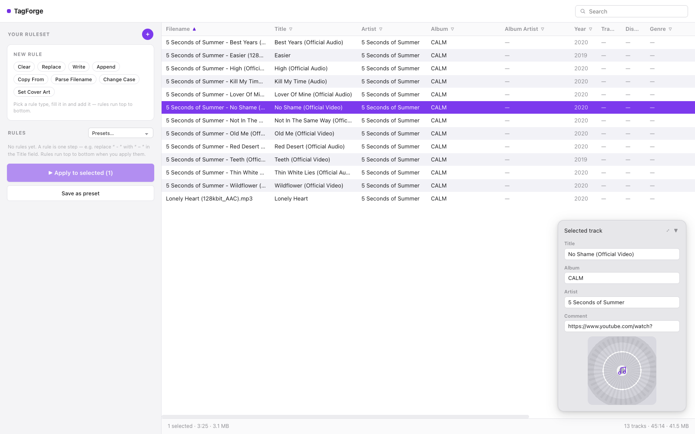

# TagForge

A free, open-source **rule-based audio metadata batch editor** for the desktop.
Built for macOS first (Windows/Linux ports planned), with a clean,
information-first UI in the spirit of MP3tag — no scripting knowledge needed.



TagForge turns the repetitive tag clean-up you do on every downloaded batch of
music into a small set of visible, editable **rules**: build a ruleset once,
preview exactly what it would change, apply it to a whole folder, and save it
as a preset for next time.

> "TagForge" is a placeholder name; branding is still to come.

## Features

- **Rules engine** — seven rule types, each a plain, understandable step:
  | Rule | What it does | Example |
  | --- | --- | --- |
  | CLEAR | Removes a field's value | Clear Comment |
  | REPLACE | Find & replace with `*` / `?` wildcards | Replace ` - ` with ` – ` in Title |
  | WRITE | Overwrites a field with a fixed value | Write J-Pop to Genre |
  | APPEND | Adds text to the end of a field | Append ` (Live)` to Title |
  | COPY FROM | Copies one field (or the file name) into another | Copy Year → Album |
  | PARSE FILENAME | Matches the file name against a pattern, fills fields from captures | `* - *` → Artist, Title |
  | CHANGE CASE | UPPER, lower, Title or Sentence case | Title → Title Case |
  | SET COVER | Embeds the same artwork in every file, or removes existing artwork | Batch album art |
- **Live preview** — the rule builder shows the before/after on a real selected
  track before you commit the rule.
- **Dry-run review** — Apply always previews every per-file change first;
  nothing is written until you confirm.
- **Presets** — save named rulesets and reload them in one click; a "Manage
  rulesets" dialog handles import, export and batch delete. Presets live in
  `~/.config/tagforge/presets.json` (override with `TAGFORGE_CONFIG_DIR`).
- **Multi-format** — reads MP3, M4A/AAC, FLAC, OGG/Opus, WAV, AIFF, WMA,
  MusePack, Monkey's Audio, WavPack and TrueAudio. Writes tags on MP3
  (ID3v2.3), M4A, FLAC/OGG/Opus, WAV/AIFF (ID3), and APEv2 formats.
- **Cover art** — displayed in the track panel and the edit window. Set it by
  clicking the artwork, dropping an image from Finder, or pasting from the
  clipboard; the edit window can also remove it, and the SET COVER rule
  batches it across files.
- **Familiar layout** — rules sidebar, MP3tag-style track table with a sticky
  header row, sortable / reorderable / resizable columns (right-click a header
  to freeze or hide columns — your layout persists between sessions), search,
  Ctrl/Cmd+A select-all, a floating "iPod" detail panel anchored bottom-right
  (collapsible, cover drag & drop / paste) and a draggable, resizable edit
  window (double-click a row) with a "More info" section.
- **Track context menu** — right-click a song for Open (default app), Open
  with…, Copy, Paste, Remove from list and Show in Finder. These use real OS
  integration in the packaged Tauri app (shell + pasteboard plugins); the
  browser dev build degrades gracefully with clipboard text and toasts.
- **Native open dialogs** — one "Add music" button opens the OS folder picker
  (Finder/Explorer) and imports every audio file in that folder *and its
  sub-folders*; you can also drop files or folders straight onto the track
  list. Browsers hide absolute paths, so dev mode re-locates the pick on disk;
  the packaged Tauri build passes paths straight from the native dialog plugin
  (no upload ever happens — files stay local).
- The rule engine is **extensible by design**: every rule is a self-describing
  class in `app/services/rules.py`, registered in one place, and the UI
  renders its editor automatically from the engine's registry — adding a new
  rule type needs no frontend work.

## Architecture

```
mp3-desktop-frontend/   React + TypeScript + Vite UI (the app shell)
mp3-metadata-api/       FastAPI engine: browsing, tag read/write,
                        the rules engine, presets — plain Python + mutagen
sample-mp3/             demo files with real tags for testing
mp3-ui/                 the Penpot design source the UI follows
docs/                   screenshots
```

The UI talks to the engine over HTTP on `127.0.0.1:8000` (`/api/…`). This is
the **sidecar model**: in the packaged app the same FastAPI process ships next
to the frontend and is launched by the shell, so the dev setup and the
production setup differ only in how the processes are started.

The engine is intentionally file-I/O and HTTP only — no native deps beyond
mutagen — so it can be bundled with PyInstaller (or run from a managed venv)
on all three platforms.

## Run it (development)

You need Node 20+, pnpm, and Python 3.13 with `uv`.

```bash
# 1. engine (terminal 1)
cd mp3-metadata-api
uv sync
.venv/bin/python main.py          # picks a free port (8000 unless taken)

# 2. UI (terminal 2)
cd mp3-desktop-frontend
pnpm install
pnpm run dev                      # the proxy follows the engine's port automatically
```

The engine writes its actual port to `~/.config/tagforge/engine.port` and
falls back to an ephemeral port when 8000 is busy, so the dev proxy and the
future Tauri sidecar launcher never hard-code a port. To auto-load a folder
while developing:

```
http://localhost:5173/?folder=/absolute/path/to/music
```

Production build of the UI: `pnpm run build` in `mp3-desktop-frontend`.

## Engine API

Interactive docs at <http://127.0.0.1:8000/docs>. Endpoints:

| Method | Path | Purpose |
| --- | --- | --- |
| GET | `/api/browse?path=` | List folders + audio files |
| GET | `/api/metadata?path=` | Read one file (tags, stream info, cover) |
| POST | `/api/tracks/read` | Read many files at once |
| POST | `/api/tracks/write` | Write fields of one file (rename supported) |
| POST | `/api/tracks/cover` | Replace embedded cover art |
| GET | `/api/rules/registry` | Rule + field catalog the UI renders from |
| POST | `/api/preview` | Dry-run one rule on given values |
| POST | `/api/apply` | Dry-run or apply a ruleset to many files |
| GET/PUT/DELETE | `/api/presets` | Named rulesets (stored in `~/.config/tagforge/`) |

## Packaging as a native app (planned)

The final deliverable is a **Tauri** app (tiny binary, WebView shell, Python
sidecar) — Rust is not installed on this machine yet, so packaging is the
next milestone:

1. `src-tauri` shell with the built frontend from `mp3-desktop-frontend/dist`.
2. Bundle the engine as a sidecar binary (PyInstaller onefile from
   `mp3-metadata-api`), started by Tauri on `127.0.0.1:8000`.
3. Replace the folder browser with the native `dialog` plugin; keep the
   HTTP contract identical.

## Design notes

- Colors, spacing and layout follow the Penpot board in `mp3-ui/`
  (purple `#6D28D9`/`#7C3AED`, neutral Apple-ish grays, Inter/system font).
- The app nudges users toward rule-based editing as the default: the rules
  sidebar is always visible, the table is read-first, and manual edits are
  available for the exceptions rather than the rule.
- Wildcards: `*` matches any run of characters, `?` matches exactly one.
  REPLACE treats **Replace with** literally (there are no capture references);
  to move part of a value into a field, use PARSE FILENAME, which assigns each
  `*` capture to a field through a dropdown.
- A rule must be complete before it can be committed: REPLACE needs a **Find**
  pattern (an empty one would match everywhere), and PARSE FILENAME needs a
  pattern plus at least one capture assigned to a field. The engine reports
  these requirements as `required` params in `/api/rules/registry`, and the
  rule builder keeps its button disabled until they are met.

## License

Free and open source (license to be chosen before first release).
